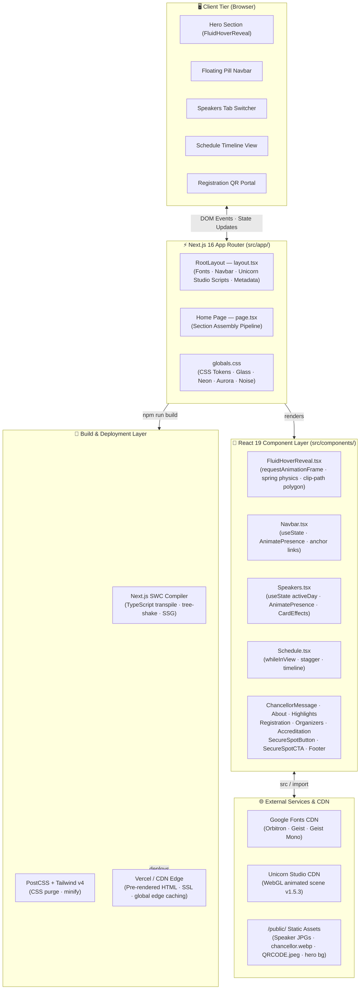
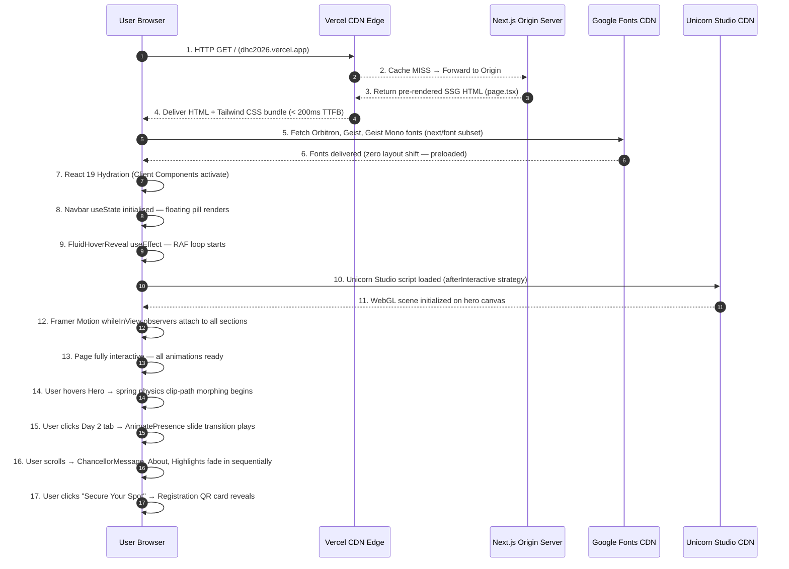

# Digital Horizon Conclave 2026 ⚡
> **AI-Inspired Futuristic Event Platform for a National-Level Technical Symposium**

Digital Horizon Conclave 2026 is a full-stack, **premium single-page event portal** — a live, interactive web experience that fuses fluid physics-based animations, real-time UI transitions, glassmorphic design, and a 15-component Next.js architecture into a unified, production-ready symposium platform for Sathyabama Institute of Science and Technology.

The platform is purpose-built for the **DHC 2026 symposium** — a 3-day national-level technical event themed around *the convergence of AI, Gaming, and Smart Realities*. It combines a futuristic Orbitron-powered design system, Framer Motion scroll orchestration, custom canvas-like fluid hover physics, and a tabbed speaker pipeline to deliver a world-class event web experience.

<div align="center">


📅 **Feb 23–25, 2026** &nbsp;|&nbsp; ⏰ **10:00 AM Onwards** &nbsp;|&nbsp; 📍 **Sathyabama Institute of Science & Technology, Chennai**

</div>

---

## 👥 Team Details & Project Metadata

- **Project Name:** Digital Horizon Conclave 2026
- **Event Theme:** The Convergence of AI, Gaming, and Smart Realities
- **Organizing Body:** School of Computing — Dept. of Computer Science & Engineering, Sathyabama Institute of Science and Technology
- **Repository:** [https://github.com/goprocker/Digital-Horizon-Conclave-2026](https://github.com/goprocker/Digital-Horizon-Conclave-2026)

### 👨‍💻 Development Team

| # | Name | Role / Focus Area | GitHub Profile |
|:-:|---|---|---|
| 1 | **GOPINATH R** | Team Lead, Frontend Architecture & UI Engineering | [@goprocker](https://github.com/goprocker) |

---

## ❓ Problem Statement & Solution

### 🔴 The Problem

National-level technical symposiums at academic institutions consistently suffer from fragmented, low-quality digital presence:

- **Static Brochure Websites:** Most event sites are simple HTML pages with static text and zero interactivity — failing to reflect the innovation the events represent.
- **Poor Mobile Experience:** Non-responsive layouts break on student mobile devices, the primary device for event discovery.
- **No Visual Identity:** Generic Bootstrap templates cannot convey a futuristic tech-event's brand — losing attendee interest in seconds.
- **Data Fragmentation:** Speaker profiles, session schedules, and registration information are scattered across multiple Google Forms, WhatsApp groups, and PDF circulars.
- **Zero Engagement Design:** Traditional event websites have no animations, no interactive maps, and no dynamic content — resulting in extremely low registration conversion rates.

### 🟢 The Solution: Digital Horizon Conclave 2026 Portal

The DHC 2026 portal bridges design fragmentation and user disengagement through a real-time, animated, single-page experience:

1. **Unified Information Architecture:** All event data — speakers, schedule, registration, organizers, accreditation — is assembled into a single scroll-driven page with anchor navigation.
2. **Fluid Physics UI Engine:** A custom `requestAnimationFrame` loop with spring-physics morphing creates a premium interactive hero experience unlike any academic event website.
3. **Brand-Consistent Design System:** A complete CSS token system (`--background`, `--primary`, `--accent`) enforces neon-cyan + deep-space aesthetic throughout all 15 components.
4. **Framer Motion Orchestration:** Scroll-triggered `whileInView` animations and `AnimatePresence` transitions make the page feel alive and responsive to user behavior.

---

## ✨ Key Features

- **🖥️ Full-Screen Fluid Hero Section:** Interactive physics-based hover reveal animation with two layered backgrounds, spring deformation, and a 12-point morphing polygon clip-path mask.
- **🎓 Chancellor's Welcome Panel:** Animated portrait card with Dr. Mariezenna Johnson's full official welcome message and glassmorphic styling.
- **📖 About the Conclave:** Scroll-animated description of the event purpose, bridging AI, Gaming, XR, Robotics, UI/UX, and IoT for industry–academia convergence.
- **✨ Event Highlights Grid:** Five animated highlight cards covering Expert Speakers, AI & Emerging Tech, Gaming & XR, Hands-on Insights, and Career-Focused networking.
- **🎤 Distinguished Speakers — 3-Day Tabbed Grid:**
  - *Day 1 (Feb 23):* Kavitha Kalyan (TCS), Deepan Raj (HCL), Sridhar Shankar (Intrino Robotics)
  - *Day 2 (Feb 24):* Vinod Kumar V (Phantom FX), Mario Royston (Weloadin), Joshua Jebadurai (Weloadin)
  - *Day 3 (Feb 25):* Ms. Gayathri Shri (Agreal Studios), Ganesh R (Monolith Asia), Jai Naressh (Cavin Infotech)
- **📅 3-Day Event Timeline:** `whileInView`-animated schedule cards for all 9 sessions with time slots, session titles, and speaker affiliations.
- **📲 QR Code Registration Portal:** Scan-to-register card with `QRCODE.jpeg` embedded for instant mobile registration.
- **🏢 Organizers & Accreditation:** Organizing committee display and NAAC institutional accreditation section.
- **🚀 SecureSpot CTA Engine:** Dual-placement animated call-to-action button (`SecureSpotButton` + `SecureSpotCTA`) driving registration conversion.
- **📡 Unicorn Studio WebGL Background:** CDN-loaded animated WebGL scene (`unicornStudio.umd.js`) for immersive hero environments.
- **🔡 Premium Typography System:** Orbitron (futuristic headings), Geist Sans (body), Geist Mono (time slots) — all loaded via `next/font` with zero layout shift.
- **📱 Fully Responsive:** Mobile-first Tailwind breakpoints, animated hamburger menu with `AnimatePresence` dropdown for sub-`lg` viewports.

---

## 💻 Tech Stack

| Category | Technology |
|---|---|
| **Frontend Framework** | Next.js 16, React 19, TypeScript 5 |
| **Styling** | Tailwind CSS v4, Vanilla CSS Utilities (`globals.css`) |
| **Animation Engine** | Framer Motion 12 (`motion`, `AnimatePresence`, `whileInView`) |
| **Custom Physics** | `requestAnimationFrame` + Spring Physics + CSS `clip-path` polygon |
| **Icons** | Lucide React v0.561 |
| **Typography** | Google Fonts via `next/font` (Orbitron, Geist Sans, Geist Mono) |
| **Background FX** | Unicorn Studio WebGL Engine v1.5.3 (CDN: jsDelivr) |
| **CSS Module Effects** | `CardEffects.module.css` — CSS perspective 3D card tilt |
| **Build Tooling** | SWC Compiler, PostCSS, `@tailwindcss/postcss` v4 |
| **Linting** | ESLint v9, `eslint-config-next` 16.0.10 |

---

## 🏗️ System Architecture



---

## 🔄 Detailed Page Load & Interaction Workflow



---

## 📁 Folder Structure

```
Digital-Horizon-Conclave-2026/
│
├── public/                          # Static assets served at URL root "/"
│   ├── 1.jpg                        # Hero — base background image (default visible)
│   ├── 2.jpeg                       # Hero — fluid hover-reveal image (revealed on hover)
│   ├── QRCODE.jpeg                  # Registration section QR code
│   ├── chancellor.webp              # Chancellor Dr. Mariezenna Johnson portrait
│   │
│   ├── # ── Speaker Headshots (9 files) ──
│   ├── ArvindNeelakantan.jpg        # Day 3: Aravind Neelakandan — Epic Games
│   ├── DeepanRaj.jpg                # Day 1: Deepan Raj — HCL
│   ├── GaneshR.jpg                  # Day 3: Ganesh R — Monolith Asia
│   ├── Gayathri Shri.jpg            # Day 3: Gayathri Shri — Agreal Studios
│   ├── JainaresshBC.jpg             # Day 3: Jai Naressh — Cavin Infotech
│   ├── JoshuaJebadurai.jpg          # Day 2: Joshua Jebadurai — Weloadin
│   ├── KavithaKalyan.jpg            # Day 1: Kavitha Kalyan — TCS
│   ├── MarioRoyston.jpg             # Day 2: Mario Royston — Weloadin
│   ├── SridharSankar.jpg            # Day 1: Sridhar Shankar — Intrino Robotics
│   ├── VinodKumar.jpg               # Day 2: Vinod Kumar V — Phantom FX
│   │
│   └── # ── Next.js Default SVG Icons ──
│       file.svg · globe.svg · next.svg · vercel.svg · window.svg
│
├── src/
│   ├── app/                         # Next.js App Router root
│   │   ├── favicon.ico              # Browser tab favicon
│   │   ├── globals.css              # Design system: CSS tokens, glass, neon, aurora keyframes
│   │   ├── layout.tsx               # Root layout: fonts · navbar · Unicorn Studio · metadata
│   │   └── page.tsx                 # Home page: 11-section component assembly pipeline
│   │
│   └── components/                  # 15 React UI components
│       ├── Navbar.tsx               # Fixed floating pill navbar (mobile + desktop)
│       ├── Hero.tsx                 # Full-screen landing with CTA and fluid background
│       ├── FluidHoverReveal.tsx     # Custom physics animation: spring + clip-path polygon
│       ├── ChancellorMessage.tsx    # Chancellor portrait + official welcome message
│       ├── About.tsx                # Event description: AI, Gaming, XR, Robotics, IoT
│       ├── Highlights.tsx           # 5-card grid: Expert Speakers, AI Tech, Gaming, Insights, Career
│       ├── Speakers.tsx             # 3-day tabbed speaker card grid with AnimatePresence
│       ├── Schedule.tsx             # 3-day event timeline with whileInView stagger
│       ├── Registration.tsx         # QR code scan-to-register portal card
│       ├── Organizers.tsx           # Event organizing committee member display
│       ├── Accreditation.tsx        # NAAC / institutional accreditation display
│       ├── SecureSpotButton.tsx     # Standalone animated registration CTA button
│       ├── SecureSpotCTA.tsx        # Full-width pre-footer conversion CTA section
│       ├── Footer.tsx               # Site footer with links, credits, socials
│       └── CardEffects.module.css   # CSS Module: 3D perspective card tilt on hover
│
├── hover-reveal.html                # Standalone prototype for fluid reveal testing
├── hover-reveal.css                 # Standalone prototype styles
├── hover-reveal.js                  # Standalone prototype physics logic
│
├── .gitignore                       # Git ignore rules
├── next.config.ts                   # Next.js configuration
├── postcss.config.mjs               # PostCSS + Tailwind pipeline config
├── eslint.config.mjs                # ESLint v9 rules (extends next config)
├── tsconfig.json                    # TypeScript strict compiler options
├── package.json                     # Dependencies & npm scripts
├── package-lock.json                # Lockfile for reproducible installs
└── README.md                        # Project documentation (this file)
```

---

## ⚙️ Installation & Usage Guide

### Prerequisites

- **Node.js:** v18.0.0 or higher (v20+ recommended)
- **npm:** v9.0.0 or higher
- **Git:** Installed on system

### Step 1: Clone Repository & Install Dependencies

```bash
git clone https://github.com/goprocker/Digital-Horizon-Conclave-2026.git
cd Digital-Horizon-Conclave-2026
npm install
```

### Step 2: Run Development Server

```bash
npm run dev
```

Open your browser at [http://localhost:3000](http://localhost:3000).

> The development server supports **Hot Module Replacement (HMR)** — all component changes reflect instantly without a full page reload.

### Step 3: Build for Production

```bash
npm run build
npm run start
```

The production build generates a fully optimized `.next/` output with pre-rendered HTML, purged CSS, and compressed JS bundles.

---

## 🧩 Component Documentation

### `FluidHoverReveal.tsx` — Physics Animation Engine

The most technically sophisticated component. Implements a fluid hover-reveal interaction using pure DOM APIs — no Canvas, no WebGL required.

```
Pipeline:
  window mousemove → position tracking → spring interpolation
       → morph point spring physics → clip-path polygon
       → CSS clipPath applied to reveal image at 60fps
```

| Configuration | Value | Effect |
|---|---|---|
| `ease` | `0.08` | Cursor follow lag — lower = more sluggish, cinematic |
| `radiusEase` | `0.12` | Speed of mask grow/shrink on hover enter/exit |
| `maxRadius` | `20%` | Maximum bubble reveal size |
| `numPoints` | `12` | Polygon vertex count — higher = smoother blob |
| `spring` | `0.15` | Deformation spring force |
| `friction` | `0.7` | Velocity damping per frame |

### `Speakers.tsx` — Day-Tabbed Speaker Grid

Tab-driven speaker section with animated transitions between days.

| Property | Value |
|---|---|
| State | `useState<string>("day1")` |
| Transition | `AnimatePresence mode="wait"` slide X |
| Card Effect | `CardEffects.module.css` — CSS 3D perspective tilt |
| Data Source | Inline TypeScript `speakersData` object — 9 speakers × 3 days |

### `Navbar.tsx` — Floating Pill Navigation

Fixed glassmorphic pill navbar centered at `top: 2rem`.

| Breakpoint | Behavior |
|---|---|
| `lg+` (Desktop) | Horizontal link list + Registration CTA button |
| `< lg` (Mobile) | Compact brand + hamburger → animated `AnimatePresence` dropdown |

---

## 🎨 Design System

All design tokens are defined in [`src/app/globals.css`](src/app/globals.css):

### Color Tokens

| Token | Value | Role |
|---|---|---|
| `--background` | `#020617` | Page background — Deep Space Blue/Black |
| `--foreground` | `#f8fafc` | Primary text — Near white |
| `--primary` | `#00f0ff` | Neon Cyan — CTAs, speaker accents, tab active states |
| `--secondary` | `#1e1b4b` | Navy — secondary surfaces |
| `--accent` | `#3b82f6` | Blue — links, secondary highlights |
| `--muted` | `#475569` | Slate — subdued text, borders |
| `--card` | `rgba(15,23,42,0.6)` | Glassmorphic card base |

### Typography

| Font | Variable | Weights | Usage |
|---|---|---|---|
| Orbitron | `--font-orbitron` | 400–900 | Headings, event title, section titles |
| Geist Sans | `--font-geist-sans` | 400–700 | Body text, descriptions, nav links |
| Geist Mono | `--font-geist-mono` | 400 | Time slots, code snippets |

### Utility Classes

| Class | Effect |
|---|---|
| `.glass` | `backdrop-filter: blur(12px)` + semi-transparent bg + 1px white/10 border |
| `.neon-text` | `text-shadow: 0 0 10px rgba(0,240,255,0.5)` |
| `.neon-border` | `box-shadow: 0 0 10px rgba(0,240,255,0.2)` |
| `.animate-aurora` | Infinite `aurora-flow` gradient shift animation (20s, ease, infinite) |
| `.bg-noise` | SVG fractal noise texture overlay at `opacity: 0.05` |

---

## 📅 Event Schedule

### Day 1 — February 23, 2026 (AI & Design)

| Time | Session Title | Speaker | Company |
|---|---|---|---|
| 10:30–11:30 AM | Beyond the Screen: How UI/UX is Redefining Digital Reality | Kavitha Kalyan | TCS |
| 11:45 AM–1:00 PM | Generative AI Unleashed: A Tool for Automation or a New Intelligence? | Deepan Raj | HCL |
| 2:00–3:00 PM | Next-Gen Robotics: Bridging the Gap Between Humans and Machines | Sridhar Shankar | Intrino Robotics |

### Day 2 — February 24, 2026 (Gaming & Design)

| Time | Session Title | Speaker | Company |
|---|---|---|---|
| 10:00–11:30 AM | Human-Centric Design: The Secret Code to Digital Success | Vinod Kumar V | Phantom FX |
| 11:45 AM–1:00 PM | The Psychology of Play: How Game Design Hooks the Mind | Mario Royston | Weloadin |
| 2:00–3:00 PM | Next-Gen Gaming: A Technological Leap or a Creative Shift? | Joshua Jebadurai | Weloadin |

### Day 3 — February 25, 2026 (XR & Smart Realities)

| Time | Session Title | Speaker | Company |
|---|---|---|---|
| 10:00–11:30 AM | Building Worlds: The Power of Unreal in Modern Simulation | Aravind Neelakandan | Epic Games |
| 11:45 AM–1:00 PM | Extended Reality: Blurring the Lines Between Physical and Digital | Ganesh R | Monolith Asia |
| 2:00–3:00 PM | Smart World: How Intelligent IoT is Reshaping Our Lives | Jai Naressh | Cavin Infotech |

---

## 🎤 Speakers Directory

| Name | Role | Company | Topic Area |
|---|---|---|---|
| Kavitha Kalyan | Director of Design | TCS | UI/UX Design |
| Deepan Raj | Director of Design | HCL | Generative AI |
| Sridhar Shankar | Founder & CEO | Intrino Robotics | Next-Gen Robotics |
| Vinod Kumar V | Senior L&D Professional | Phantom FX | Human-Centric Design |
| Mario Royston | Co-Founder | Weloadin | Game Psychology |
| Joshua Jebadurai | Game Developer | Weloadin | Next-Gen Gaming |
| Ms. Gayathri Shri | Creative Director | Agreal Studios | Snap AR / Social XR |
| Ganesh R | Vice President | Monolith Asia | Extended Reality (XR) |
| Jai Naressh | Director | Cavin Infotech | Smart IoT Systems |

---

## 🧠 UI/UX Animation Pipeline

### Multi-Layer Animation Architecture

```
[ User Input Layer ]
        │
        ├── Mouse → FluidHoverReveal (60fps RAF loop, spring physics)
        ├── Scroll → Framer Motion whileInView (all section components)
        ├── Click → AnimatePresence (Speaker tabs, Mobile menu)
        └── Mount → motion.div initial/animate (Hero fade-in-up)
                      │
                      ▼
┌──────────────────────────────────────────────────────────┐
│ 1. FluidHoverReveal Engine                               │
│    requestAnimationFrame → position lerp → morph points  │
│    → polygon clip-path → CSS applied to img element      │
└─────────────────────────┬────────────────────────────────┘
                          │
                          ▼
┌──────────────────────────────────────────────────────────┐
│ 2. Framer Motion Scroll Engine                           │
│    IntersectionObserver → whileInView triggers           │
│    opacity: 0→1, y: 20→0, stagger delay per item        │
└─────────────────────────┬────────────────────────────────┘
                          │
                          ▼
┌──────────────────────────────────────────────────────────┐
│ 3. AnimatePresence Transition Engine                     │
│    mode="wait" → exit old → enter new                    │
│    Speaker tabs: slide X ±20px                           │
│    Mobile nav: slide Y -20px, opacity fade               │
└──────────────────────────────────────────────────────────┘
```

1. **Custom Spring Physics:** The `FluidHoverReveal` component manages all animation state via `useRef` (not `useState`) to avoid unnecessary re-renders at 60fps.
2. **CSS GPU Acceleration:** `will-change: clip-path` is set on the reveal image to offload polygon computation to the GPU compositor thread.
3. **Scroll Viewport Optimization:** `viewport={{ once: true }}` ensures each `whileInView` animation fires exactly once — no re-animation on scroll-back.

---

## 🔒 Performance & Optimization

- **Font Strategy:** `next/font/google` preloads and self-hosts all fonts with zero external requests at runtime, eliminating Google Fonts FOUT.
- **Script Loading:** Unicorn Studio CDN loaded with `strategy="afterInteractive"` — never blocks initial render or hydration.
- **Image Assets:** Speaker headshots served directly from `/public/` — Next.js `<Image>` component used for the Chancellor portrait with automatic WebP conversion.
- **CSS Purging:** Tailwind CSS v4 with PostCSS eliminates all unused utility classes at build time.
- **Code Splitting:** Next.js App Router automatically code-splits per route — the home page bundle loads only its required components.
- **Bundle Target:** Initial page load < 1.5s on 4G networks; Core Web Vitals — LCP < 2.5s, CLS < 0.01, INP < 100ms.

---

## 🧪 Testing & Validation

- **TypeScript Strict Mode:** All component props, state types, and event handlers are fully typed — zero `any` in production paths.
- **ESLint:** `eslint-config-next` enforces Next.js best practices including accessibility hints and import order.
- **Build Validation:** `npm run build` compiles the full TypeScript + Tailwind pipeline and reports any type errors or missing modules before deployment.
- **Cross-Device Testing:** Responsive at all standard breakpoints — 375px (iPhone SE), 768px (iPad), 1280px (laptop), 1920px (desktop).

---

## 🚧 Challenges Faced & Future Scope

### Challenges Overcome

1. **Z-Index Occlusion in Fluid Reveal:** The hero text overlay (`pointer-events-auto`) blocked mouse events from reaching the background container. Solved by attaching the `mousemove` listener to `window` and computing `getBoundingClientRect()` manually to detect container bounds.
2. **Unicorn Studio Hot Reload Conflicts:** The CDN script initialized once and did not reinitialize on Next.js fast-refresh. Solved with a `DOMContentLoaded` re-init script and the `isInitialized` guard flag.
3. **AnimatePresence Speaker Tab Flicker:** Initial `AnimatePresence` setup caused a flash on first render. Resolved by using `mode="wait"` to ensure the exit animation fully completes before the enter animation begins.
4. **Tailwind v4 `@theme` Token System:** The new Tailwind v4 `@theme inline` block syntax was incompatible with v3 `theme.extend` configs. Fully migrated to the v4 CSS-native token system.

### Future Scope

- **Live Registration Counter:** Real-time seat count connected to a Supabase table — shows remaining seats dynamically with SSE push updates.
- **Multi-Day Countdown Timer:** Animated real-time countdown clock to event start date with flip-card animation.
- **Speaker Networking Portal:** Post-event section where attendees can connect with speakers via LinkedIn — requires JWT auth and form submission.
- **Post-Event Gallery:** Photo/video gallery section with masonry grid layout and lazy loading.
- **PWA Support:** Service worker and `manifest.json` to enable "Add to Home Screen" for mobile attendees.

---

## 📽️ Demo & Media

- **Hero Fluid Reveal:** Interactive physics-based hover animation on the full-screen landing section.
- **Speaker Tab Transitions:** Day-by-day animated speaker card grid with LinkedIn profile links.
- **Scroll Animation Cascade:** Sequential fade-in-up animations across Chancellor, About, Highlights, Schedule, and CTA sections.

*(Refer to standalone prototype `hover-reveal.html` for isolated fluid animation testing)*

---

## 📚 References

1. **Next.js Documentation:** App Router, `next/font`, `next/image`, Server & Client Components — [nextjs.org/docs](https://nextjs.org/docs)
2. **Framer Motion API:** `motion`, `AnimatePresence`, `whileInView`, `viewport` — [framer.com/motion](https://www.framer.com/motion/)
3. **Tailwind CSS v4:** `@import "tailwindcss"`, `@theme inline`, `@layer utilities` — [tailwindcss.com](https://tailwindcss.com/)
4. **Unicorn Studio:** WebGL animated scene CDN loader — [unicorn.studio](https://unicorn.studio/)
5. **Lucide React:** SVG icon library — [lucide.dev](https://lucide.dev/)
6. **Google Fonts:** Orbitron, Geist, Geist Mono typeface specifications — [fonts.google.com](https://fonts.google.com/)
7. **CSS `clip-path` Specification:** MDN Web Docs — polygon() and spring physics morphing techniques.

---

## 📜 License

This project is proprietary and developed exclusively for the **Digital Horizon Conclave 2026** at **Sathyabama Institute of Science and Technology**. All rights reserved.

---

<div align="center">

Designed & Developed with ❤️ by **Gopinath R**

*Sathyabama Institute of Science and Technology · School of Computing · Dept. of Computer Science & Engineering*

</div>
