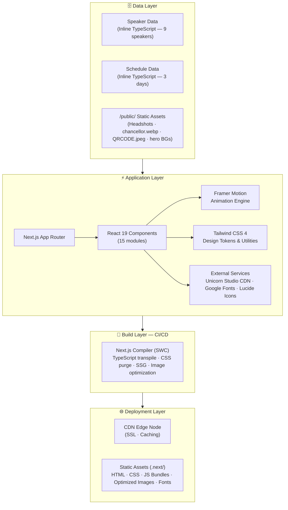
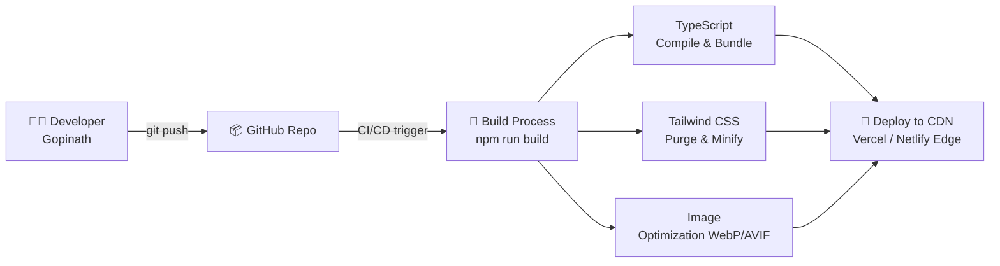
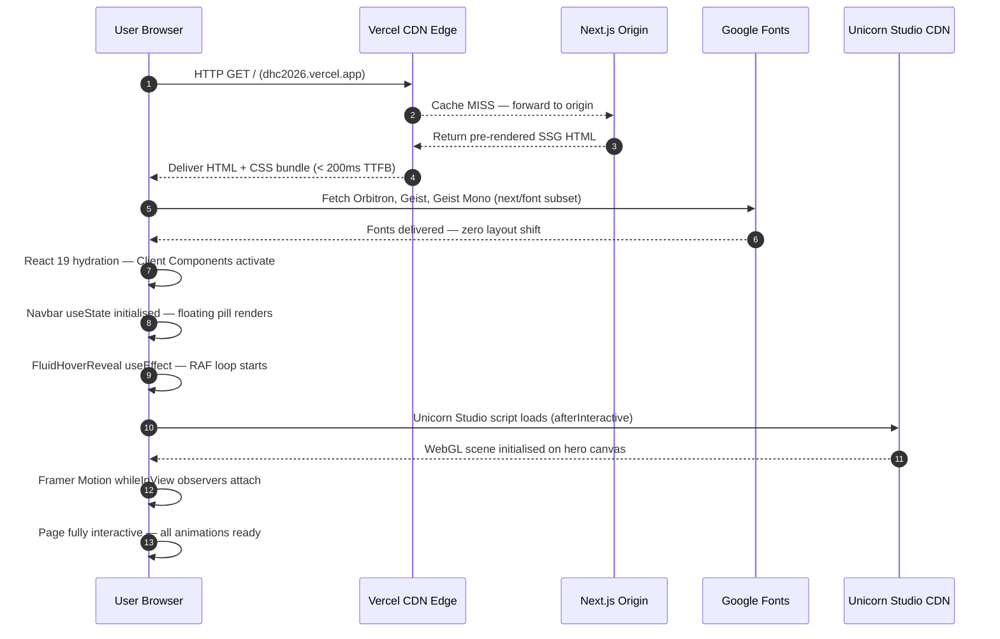
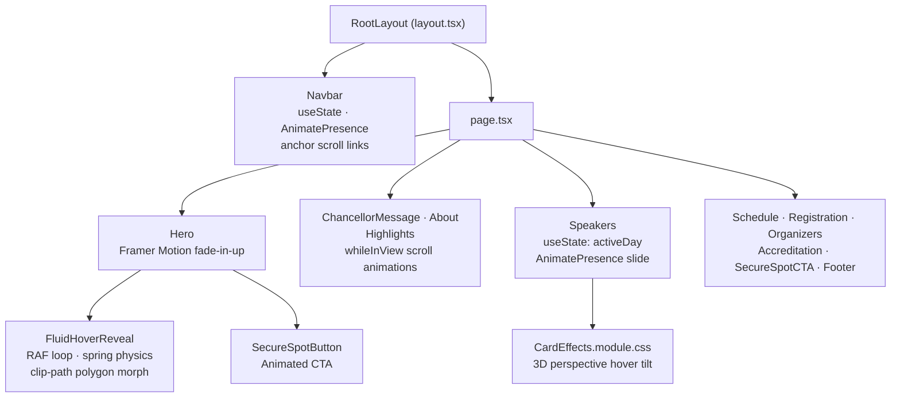

# 🌐 Digital Horizon Conclave 2026

<div align="center">


**The Convergence of AI, Gaming, and Smart Realities**
*A National Level Technical Symposium — Sathyabama Institute of Science & Technology*

📅 **Feb 23–25, 2026** &nbsp;|&nbsp; ⏰ **10:00 AM Onwards** &nbsp;|&nbsp; 📍 **Sathyabama Institute, Chennai**

</div>

---

## 📋 Table of Contents

- [Overview](#-overview)
- [Tech Stack](#-tech-stack)
- [Project Architecture](#-project-architecture)
- [System Architecture](#-system-architecture)
- [Digital System Workflow](#-digital-system-workflow)
- [Folder Structure](#-folder-structure)
- [Component Breakdown](#-component-breakdown)
- [Design System](#-design-system)
- [Key Features](#-key-features)
- [Event Schedule](#-event-schedule)
- [Speakers](#-speakers)
- [Getting Started](#-getting-started)
- [Scripts](#-scripts)
- [Deployment](#-deployment)

---

## 🎯 Overview

**Digital Horizon Conclave 2026** is the official event website for a premier **National-Level Technical Symposium** organized by the *School of Computing, Department of Computer Science & Engineering* at **Sathyabama Institute of Science and Technology**.

The website serves as a fully-featured, single-page event portal covering:

- 🤖 Artificial Intelligence & Generative AI
- 🎮 Game Design & Development
- 🥽 Extended Reality (XR / AR / VR)
- 🦾 Robotics & Automation
- 🎨 UI/UX Design
- 🌐 Internet of Things (IoT)

Built with a **dark futuristic theme**, neon accents, glassmorphism effects, and fluid physics-based animations to create a premium digital experience.

---

## 🛠️ Tech Stack

| Category | Technology | Version | Purpose |
|---|---|---|---|
| **Framework** | Next.js | 16.0.10 | App Router, SSR, routing, image optimization |
| **UI Library** | React | 19.2.1 | Component model, hooks |
| **Language** | TypeScript | ^5 | Type safety across all components |
| **Styling** | Tailwind CSS | ^4 | Utility-first CSS, responsive design |
| **Animations** | Framer Motion | ^12.23.26 | Scroll animations, transitions, `AnimatePresence` |
| **Icons** | Lucide React | ^0.561.0 | SVG icon set (Calendar, Clock, MapPin, Linkedin, etc.) |
| **Fonts** | Google Fonts | via `next/font` | Geist, Geist Mono, Orbitron |
| **Background FX** | Unicorn Studio | v1.5.3 (CDN) | Animated interactive background scenes |
| **Linting** | ESLint | ^9 | Code quality with `eslint-config-next` |
| **PostCSS** | @tailwindcss/postcss | ^4 | Tailwind compilation |

---

## 🏗️ Project Architecture

```
┌──────────────────────────────────────────────────────────────────┐
│                    Next.js App Router                            │
│            src/app  (Server Components by default)               │
└─────────────────────────┬────────────────────────────────────────┘
                          │
┌─────────────────────────▼────────────────────────────────────────┐
│                  RootLayout  (layout.tsx)                        │
│  • Google Fonts: Geist / Geist Mono / Orbitron                   │
│  • Global <Navbar /> (fixed floating pill)                       │
│  • Unicorn Studio CDN Loader (afterInteractive scripts)          │
│  • SEO Metadata export                                           │
└─────────────────────────┬────────────────────────────────────────┘
                          │
┌─────────────────────────▼────────────────────────────────────────┐
│                    Home Page  (page.tsx)                         │
│   <Hero /> → <ChancellorMessage /> → <About /> → <Highlights />  │
│   → <Speakers /> → <Schedule /> → <Registration />              │
│   → <Organizers /> → <Accreditation /> → <SecureSpotCTA />      │
│   → <Footer />                                                   │
└──────────────────────────────────────────────────────────────────┘
```

### Rendering Strategy

| Component | Mode | Reason |
|---|---|---|
| `page.tsx` | Server Component | Static export, no browser APIs |
| `layout.tsx` | Server Component | Metadata + font injection |
| `Navbar.tsx` | Client Component | `useState` for mobile menu toggle |
| `Hero.tsx` | Client Component | Framer Motion animations |
| `FluidHoverReveal.tsx` | Client Component | `useEffect` + `requestAnimationFrame` + DOM APIs |
| `Speakers.tsx` | Client Component | `useState` for day tab switching |
| `Schedule.tsx` | Client Component | Framer Motion `whileInView` |
| All others | Client Component | Framer Motion scroll triggers |

---

## 🖥️ System Architecture



### Layer Summary

| Layer | Purpose | Technologies |
|---|---|---|
| **Deployment** | Edge delivery, SSL, caching | Vercel CDN / Netlify Edge / any Node host |
| **Build** | Compile, optimize, bundle | Next.js 16, SWC, PostCSS |
| **Application** | UI rendering, interactivity, animations | React 19, Framer Motion 12, Tailwind CSS 4 |
| **External Services** | Runtime-loaded assets | Unicorn Studio CDN, Google Fonts |
| **Data** | Event content & media | Inline TypeScript objects + `/public/` images |

---

## 🔄 Digital System Workflow

### Build & Deploy Pipeline



### User Request Lifecycle



### Component Interaction Flow



---

## 📁 Folder Structure

```
Digital-Horizon-Conclave-2026/
│
├── public/                          # Static assets (served at URL root "/")
│   ├── 1.jpg                        # Hero section — base background image
│   ├── 2.jpeg                       # Hero section — fluid hover-reveal image
│   ├── QRCODE.jpeg                  # Registration QR code
│   ├── chancellor.webp              # Chancellor profile photo
│   │
│   ├── ArvindNeelakantan.jpg        # Speaker: Arvind Neelakandan (Epic Games)
│   ├── DeepanRaj.jpg                # Speaker: Deepan Raj (HCL)
│   ├── GaneshR.jpg                  # Speaker: Ganesh R (Monolith Asia)
│   ├── Gayathri Shri.jpg            # Speaker: Gayathri Shri (Agreal Studios)
│   ├── JainaresshBC.jpg             # Speaker: Jai Naressh (Cavin Infotech)
│   ├── JoshuaJebadurai.jpg          # Speaker: Joshua Jebadurai (Weloadin)
│   ├── KavithaKalyan.jpg            # Speaker: Kavitha Kalyan (TCS)
│   ├── MarioRoyston.jpg             # Speaker: Mario Royston (Weloadin)
│   ├── SridharSankar.jpg            # Speaker: Sridhar Shankar (Intrino Robotics)
│   └── VinodKumar.jpg               # Speaker: Vinod Kumar V (Phantom FX)
│
├── src/
│   ├── app/                         # Next.js App Router root
│   │   ├── favicon.ico              # Browser tab favicon
│   │   ├── globals.css              # CSS custom properties, utilities, keyframes
│   │   ├── layout.tsx               # Root layout (fonts, navbar, scripts, metadata)
│   │   └── page.tsx                 # Home page — assembles all section components
│   │
│   └── components/                  # All React UI components
│       ├── Navbar.tsx               # Fixed floating pill navbar
│       ├── Hero.tsx                 # Full-screen hero with CTA buttons
│       ├── FluidHoverReveal.tsx     # Physics-based fluid mask animation (hero bg)
│       ├── ChancellorMessage.tsx    # Chancellor's message section
│       ├── About.tsx                # Event description section
│       ├── Highlights.tsx           # Event highlights / key stats
│       ├── Speakers.tsx             # Day-tabbed speaker grid cards
│       ├── Schedule.tsx             # 3-day event timeline
│       ├── Registration.tsx         # QR code + registration details
│       ├── Organizers.tsx           # Organizing team display
│       ├── Accreditation.tsx        # NAAC / institutional accreditation
│       ├── SecureSpotButton.tsx     # Standalone animated registration CTA button
│       ├── SecureSpotCTA.tsx        # Full-width pre-footer CTA section
│       ├── Footer.tsx               # Site footer
│       └── CardEffects.module.css   # CSS Module — 3D card hover tilt effect
│
├── hover-reveal.html                # Standalone prototype for fluid reveal (dev only)
├── hover-reveal.css                 # Styles for standalone prototype
├── hover-reveal.js                  # Logic for standalone prototype
├── next.config.ts                   # Next.js configuration
├── postcss.config.mjs               # PostCSS / Tailwind compilation config
├── eslint.config.mjs                # ESLint rules (extends eslint-config-next)
├── tsconfig.json                    # TypeScript compiler config
├── package.json                     # Dependencies & npm scripts
└── README.md                        # Project documentation (this file)
```

---

## 🧩 Component Breakdown

### `layout.tsx` — Root Layout
Loads **Google Fonts** (Geist, Geist Mono, Orbitron) via `next/font/google`, exports **Next.js Metadata** for SEO, mounts `<Navbar />`, and bootstraps **Unicorn Studio** WebGL background via two `<Script strategy="afterInteractive">` tags.

---

### `Navbar.tsx` — Floating Pill Navigation
Fixed glassmorphic pill at `top: 2rem`. Desktop shows horizontal links + CTA; mobile shows hamburger → `AnimatePresence` dropdown with slide animation. Nav links: Home · About · Highlights · Speakers · Schedule · Team · Contact.

---

### `Hero.tsx` — Full-Screen Landing
Full viewport (`min-h-screen`) with `<FluidHoverReveal />` background, institution badge, Orbitron neon-gradient `h1`, event meta row (Date / Time / Venue), and two CTAs — `<SecureSpotButton />` + "View Schedule" anchor.

---

### `FluidHoverReveal.tsx` — Interactive Fluid Mask Animation
Custom physics animation using pure DOM + `requestAnimationFrame`. No Canvas or WebGL needed.

| Config | Value | Description |
|---|---|---|
| `ease` | `0.08` | Cursor follow lag |
| `radiusEase` | `0.12` | Mask growth/shrink speed |
| `maxRadius` | `20%` | Maximum reveal bubble size |
| `numPoints` | `12` | Polygon smoothness |
| `spring` | `0.15` | Deformation spring force |
| `friction` | `0.7` | Velocity damping per frame |

---

### `Speakers.tsx` — 3-Day Tabbed Speaker Grid
Tab switcher (`useState`) with `AnimatePresence mode="wait"` slide transitions. 3-column card grid per day, each card with circular headshot, role, session time, LinkedIn link, and talk title. 3D hover via `CardEffects.module.css`.

---

### `Schedule.tsx` — Event Timeline
`whileInView` stagger-animated timeline. Each session shows: 🕐 Time · 📝 Title · 🎤 Speaker + Company.

---

## 🎨 Design System

All tokens defined in `src/app/globals.css`:

### Color Tokens

| Token | Hex | Role |
|---|---|---|
| `--background` | `#020617` | Deep Space Blue/Black page background |
| `--foreground` | `#f8fafc` | Near-white primary text |
| `--primary` | `#00f0ff` | Neon Cyan — CTAs, accents, highlights |
| `--secondary` | `#1e1b4b` | Navy — secondary surfaces |
| `--accent` | `#3b82f6` | Blue — links, secondary highlights |
| `--muted` | `#475569` | Slate — subdued text, borders |
| `--card` | `rgba(15,23,42,0.6)` | Glassmorphic card base |

### Typography

| Font | Variable | Usage |
|---|---|---|
| Orbitron | `--font-orbitron` | Headings, brand name, hero title |
| Geist Sans | `--font-geist-sans` | Body text, UI labels |
| Geist Mono | `--font-geist-mono` | Time slots, code |

### Utility Classes

| Class | Effect |
|---|---|
| `.glass` | `backdrop-filter: blur(12px)` + semi-transparent bg + white/10 border |
| `.neon-text` | `text-shadow: 0 0 10px rgba(0,240,255,0.5)` |
| `.neon-border` | `box-shadow: 0 0 10px rgba(0,240,255,0.2)` |
| `.animate-aurora` | Infinite 20s gradient pan animation |
| `.bg-noise` | SVG fractal noise texture overlay |

---

## ✨ Key Features

| Feature | Implementation |
|---|---|
| 🖱️ Fluid Hover Reveal | Custom `requestAnimationFrame` + CSS `clip-path` polygon with spring physics |
| 🌊 Glassmorphism | `.glass` utility — `backdrop-filter: blur` + transparent border |
| 💫 Scroll Animations | Framer Motion `whileInView` + `AnimatePresence` |
| 📱 Responsive | Tailwind mobile-first breakpoints + animated hamburger menu |
| ⚓ Smooth Scroll | `scroll-smooth` on `<html>` + anchor navigation |
| 🔡 Premium Fonts | Orbitron headings, Geist body — zero layout shift via `next/font` |
| 🌑 Dark Theme | `#020617` deep space background throughout |
| 🎨 Neon Accents | `#00f0ff` cyan glow effects on text and borders |
| 🎭 3D Card Effects | CSS Module perspective + hover tilt |
| ♿ Semantic HTML | `<nav>`, `<main>`, `<section>`, `<footer>` structure |

---

## 📅 Event Schedule

### Day 1 — February 23, 2026

| Time | Session | Speaker | Company |
|---|---|---|---|
| 10:30–11:30 AM | Beyond the Screen: How UI/UX is Redefining Digital Reality | Kavitha Kalyan | TCS |
| 11:45–1:00 PM | Generative AI Unleashed: A Tool for Automation or a New Intelligence? | Deepan Raj | HCL |
| 2:00–3:00 PM | Next-Gen Robotics: Bridging the Gap Between Humans and Machines | Sridhar Shankar | Intrino Robotics |

### Day 2 — February 24, 2026

| Time | Session | Speaker | Company |
|---|---|---|---|
| 10:00–11:30 AM | Human-Centric Design: The Secret Code to Digital Success | Vinod Kumar V | Phantom FX |
| 11:45–1:00 PM | The Psychology of Play: How Game Design Hooks the Mind | Mario Royston | Weloadin |
| 2:00–3:00 PM | Next-Gen Gaming: A Technological Leap or a Creative Shift? | Joshua Jebadurai | Weloadin |

### Day 3 — February 25, 2026

| Time | Session | Speaker | Company |
|---|---|---|---|
| 10:00–11:30 AM | Building Worlds: The Power of Unreal in Modern Simulation | Aravind Neelakandan | Epic Games |
| 11:45–1:00 PM | Extended Reality: Blurring the Lines Between Physical and Digital | Ganesh R | Monolith Asia |
| 2:00–3:00 PM | Smart World: How Intelligent IoT is Reshaping Our Lives | Jai Naressh | Cavin Infotech |

---

## 🎤 Speakers

| Name | Role | Company | Topic Area |
|---|---|---|---|
| Kavitha Kalyan | Director of Design | TCS | UI/UX Design |
| Deepan Raj | Director of Design | HCL | Generative AI |
| Sridhar Shankar | Founder & CEO | Intrino Robotics | Robotics |
| Vinod Kumar V | Senior L&D Professional | Phantom FX | Human-Centric Design |
| Mario Royston | Co-Founder | Weloadin | Game Design |
| Joshua Jebadurai | Game Developer | Weloadin | Gaming Technology |
| Ms. Gayathri Shri | Creative Director | Agreal Studios | Augmented Reality |
| Ganesh R | Vice President | Monolith Asia | Extended Reality (XR) |
| Jai Naressh | Director | Cavin Infotech | IoT / Smart Systems |

---

## 🚀 Getting Started

### Prerequisites

- **Node.js** >= 18.x
- **npm** >= 9.x

### Installation

```bash
# 1. Clone the repository
git clone https://github.com/goprocker/Digital-Horizon-Conclave-2026.git
cd Digital-Horizon-Conclave-2026

# 2. Install all dependencies
npm install

# 3. Start the development server
npm run dev
```

Open [http://localhost:3000](http://localhost:3000) to view the site.

---

## 📜 Scripts

| Script | Command | Description |
|---|---|---|
| **Development** | `npm run dev` | Start Next.js dev server with HMR |
| **Production Build** | `npm run build` | Compile and optimize for production |
| **Production Start** | `npm run start` | Serve the production build locally |
| **Lint** | `npm run lint` | Run ESLint across the codebase |

---

## 🌍 Deployment

### Vercel (Recommended)

```bash
npm install -g vercel
vercel
```

Subsequent pushes to `main` auto-deploy via Vercel CI/CD.

### Other Providers

```bash
npm run build    # Generates .next/ output folder
npm run start    # Serves on port 3000
```

---

## 📄 License

This project is proprietary and developed exclusively for the **Digital Horizon Conclave 2026** at **Sathyabama Institute of Science and Technology**. All rights reserved.

---

<div align="center">

Designed & Developed with ❤️ by **Gopinath R**

*Sathyabama Institute of Science and Technology · School of Computing · Dept. of Computer Science & Engineering*

</div>
